

**UNIVERSIDAD PRIVADA DE TACNA**

**FACULTAD DE INGENIERÍA**

**Escuela Profesional de Ingeniería de Sistemas**

**Proyecto Antispam**

Curso: Base de Datos II

Docente: Patrick Cuadros Quiroga

Integrantes:
* Jahuira Pilco, Dayan Elvis (2022075749)
* Mamani Cori, Cristhian Carlos (2023077282)

Tacna – Perú

2026

---

Sistema Antispam  
**Documento de Arquitectura de Software**  
Versión 1.0

---

## CONTROL DE VERSIONES

| Versión | Hecha por | Revisada por | Aprobada por | Fecha | Motivo |
|--------|----------|-------------|-------------|-------|--------|
| 1.0 | Cristhian M. | Dayan J. | Patrick C. | 14/04/2026 | Versión Original |

---

## INDICE GENERAL
1. INTRODUCCIÓN
    1.1. Propósito (Diagrama 4+1)
    1.2. Alcance
    1.3. Definición, siglas y abreviaturas
    1.4. Organización del documento
2. OBJETIVOS Y RESTRICCIONES ARQUITECTONICAS
    2.1.1. Requerimientos Funcionales
    2.1.2. Requerimientos No Funcionales – Atributos de Calidad
3. REPRESENTACIÓN DE LA ARQUITECTURA DEL SISTEMA
    3.1. Vista de Caso de uso
    3.2. Vista Lógica
    3.3. Vista de Implementación (vista de desarrollo)
    3.4. Vista de procesos
    3.5. Vista de Despliegue (vista física)
4. ATRIBUTOS DE CALIDAD DEL SOFTWARE

---

## 1. INTRODUCCIÓN

**1.1. Propósito (Diagrama 4+1)**
El presente documento tiene como propósito definir la arquitectura de software del sistema "Aegis Filter" utilizando el modelo de vistas 4+1 (Lógica, Implementación, Procesos, Despliegue y Casos de Uso). Presenta una visión global del diseño, justificando cómo las decisiones arquitectónicas satisfacen los requerimientos funcionales de detección de spam y las prioridades de alto rendimiento, modularidad y fácil despliegue en la nube.

**1.2. Alcance**
Este documento se centra en el desarrollo de la arquitectura del backend en Laravel 11 y su despliegue contenedorizado. Incluye la vista lógica (MVC y Servicios), la vista de despliegue (Terraform en Azure) y la estructura de datos (MySQL). Se omiten procesos complejos de Frontend ya que el sistema opera como un middleware invisible al usuario.

**1.3. Definición, siglas y abreviaturas**
* **API:** Interfaz de Programación de Aplicaciones.
* **BDD:** Desarrollo Guiado por Comportamiento (Behavior-Driven Development).
* **Docker:** Plataforma de contenedorización de software.
* **IaC:** Infraestructura como Código (uso de Terraform).
* **MVC:** Patrón de arquitectura Modelo-Vista-Controlador.
* **NSG:** Grupo de Seguridad de Red (Azure).

**1.4. Organización del documento**
El documento está organizado en cuatro secciones principales: Objetivos y restricciones (define qué se debe cumplir), Representación de la arquitectura (donde se exponen los diagramas 4+1), y finalmente los atributos de calidad del software.

---

## 2. OBJETIVOS Y RESTRICCIONES ARQUITECTONICAS

### 2.1. Priorización de requerimientos

**Requerimientos Funcionales**

| ID | Descripcion | Prioridad |
|---|---|---|
| RF-01 | Interceptar las peticiones POST de comentarios antes de interactuar con la base de datos. | Alta |
| RF-02 | Validar el texto del comentario contra expresiones regulares para detectar múltiples URLs. | Alta |
| RF-03 | Evaluar el texto contra una lista negra de palabras ofensivas almacenadas en el sistema. | Alta |
| RF-04 | Bloquear peticiones sospechosas retornando un estado HTTP 403. | Alta |
| RF-05 | Almacenar métricas de los comentarios permitidos y rechazados. | Media |

**Requerimientos No Funcionales – Atributos de Calidad**

| ID | Descripcion | Prioridad |
|---|---|---|
| RNF-01 | Disponibilidad: El sistema debe operar en la nube de Azure mediante contenedores para asegurar un 99.9% de uptime. | Alta |
| RNF-02 | Rendimiento: El análisis heurístico de cada comentario no debe superar los 500ms para evitar cuellos de botella en la web. | Alta |
| RNF-03 | Seguridad: La base de datos debe estar aislada en una red virtual, impidiendo el acceso desde el exterior (puerto 3306 cerrado). | Alta |
| RNF-04 | Mantenibilidad: El código debe adherirse a los estándares PSR-12 y utilizar inyección de dependencias para facilitar futuras actualizaciones. | Media |

### 2.2. Restricciones
* Tecnológicas: El desarrollo debe utilizar estrictamente PHP 8.2+ y Laravel 11.
* Infraestructura: La máquina virtual en producción está restringida al plan Standard_B1ms de Azure por motivos de presupuesto académico, limitando los recursos a 1 vCPU y 2 GB de RAM.
* Despliegue: Prohibido el acceso manual FTP al servidor; todo cambio en producción debe realizarse a través del pipeline de GitHub Actions.

---

## 3. REPRESENTACIÓN DE LA ARQUITECTURA DEL SISTEMA

### 3.1. Vista de Caso de uso

**3.1.1. Diagramas de Casos de uso**
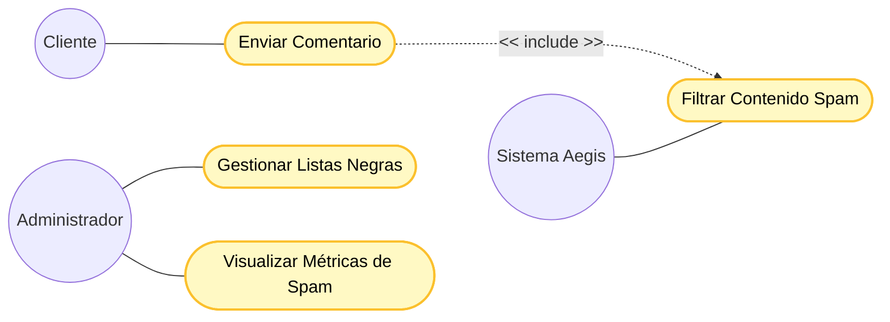

### 3.2. Vista Lógica

**3.2.1. Diagrama de Subsistemas (paquetes)**

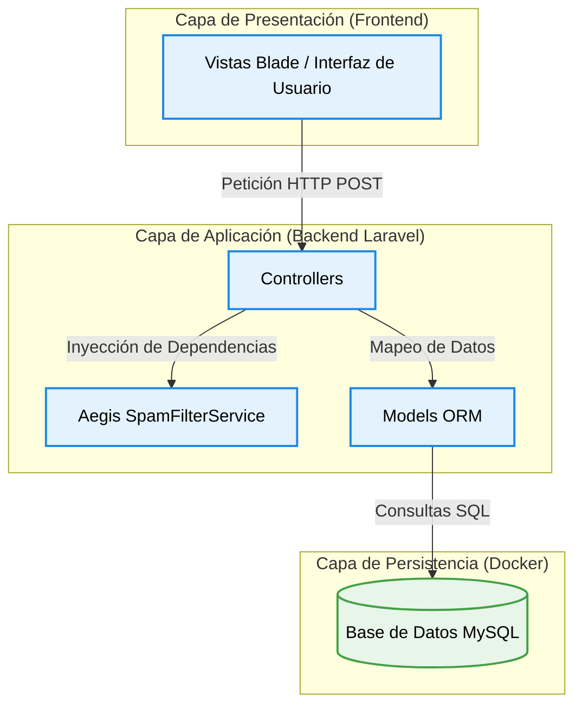

**3.2.2. Diagrama de Secuencia (vista de diseño)**
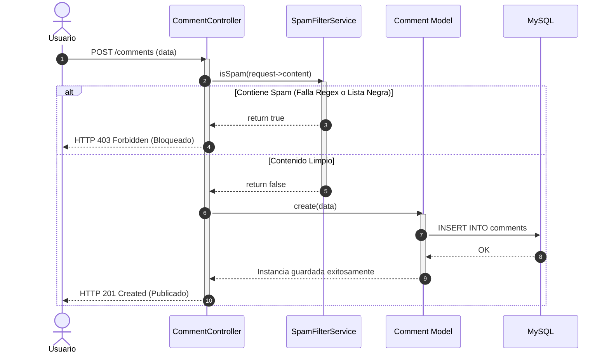

**3.2.3. Diagrama de Colaboración (vista de diseño)**

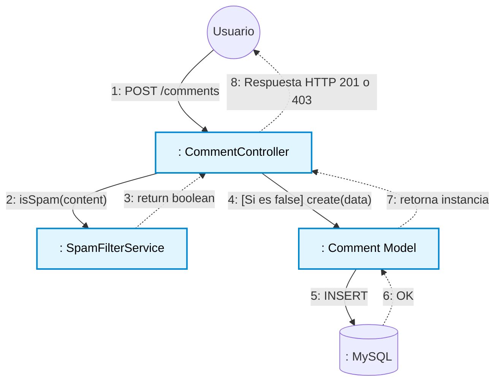

**3.2.4. Diagrama de Objetos**
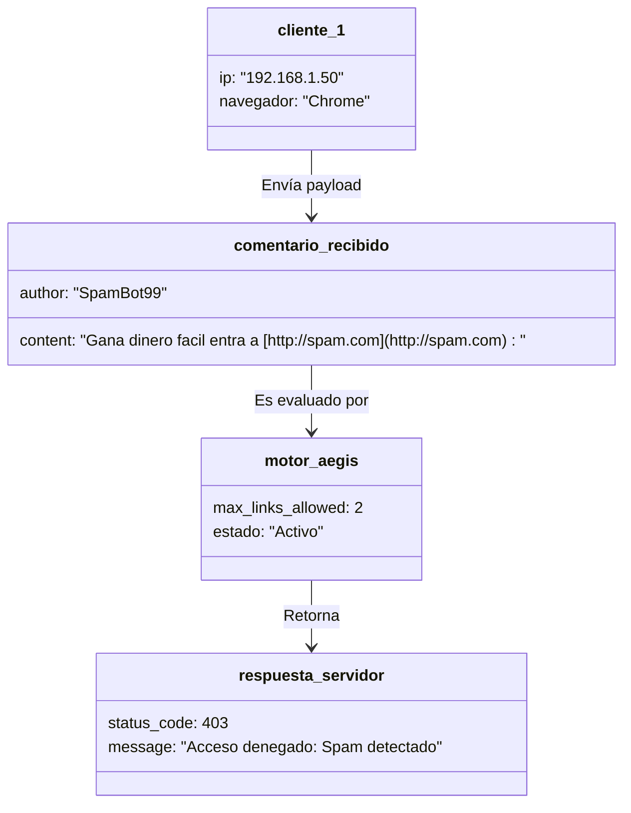

**3.2.5. Diagrama de Clases**
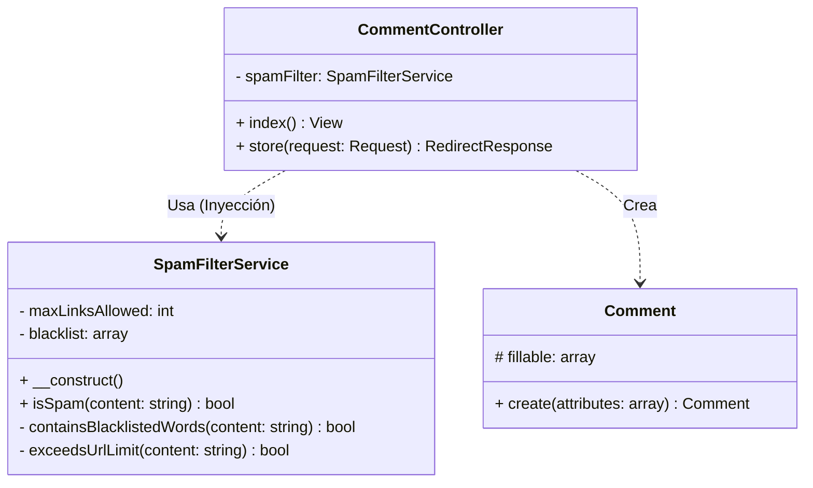

**3.2.6. Diagrama de Base de datos (relacional o no relacional)**
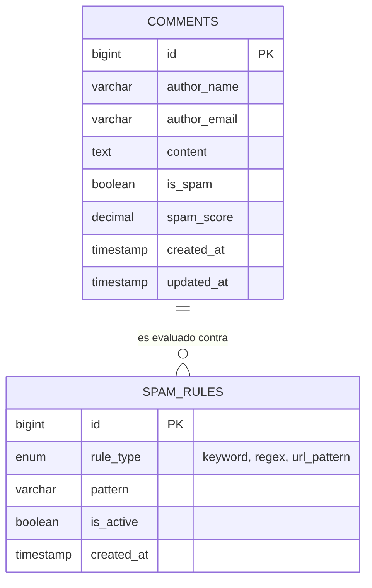

### 3.3. Vista de Implementación (vista de desarrollo)

**3.3.1. Diagrama de arquitectura software (paquetes)**
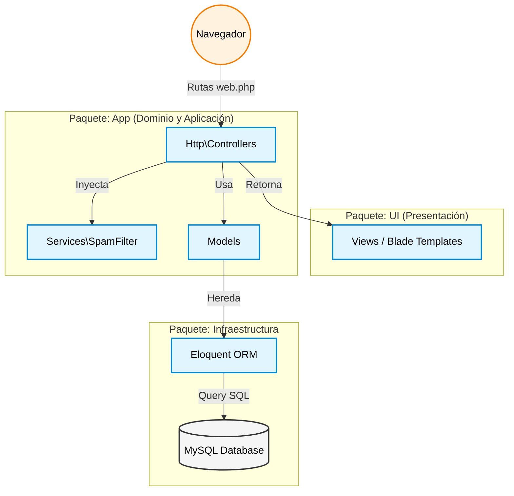

**3.3.2. Diagrama de arquitectura del sistema (Diagrama de componentes)**
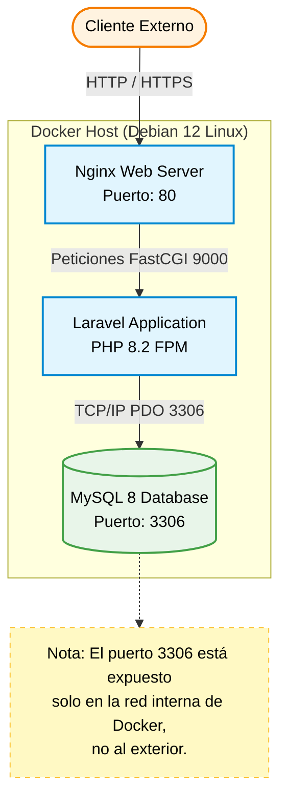

### 3.4. Vista de procesos

**3.4.1. Diagrama de Procesos del sistema (diagrama de actividad)**
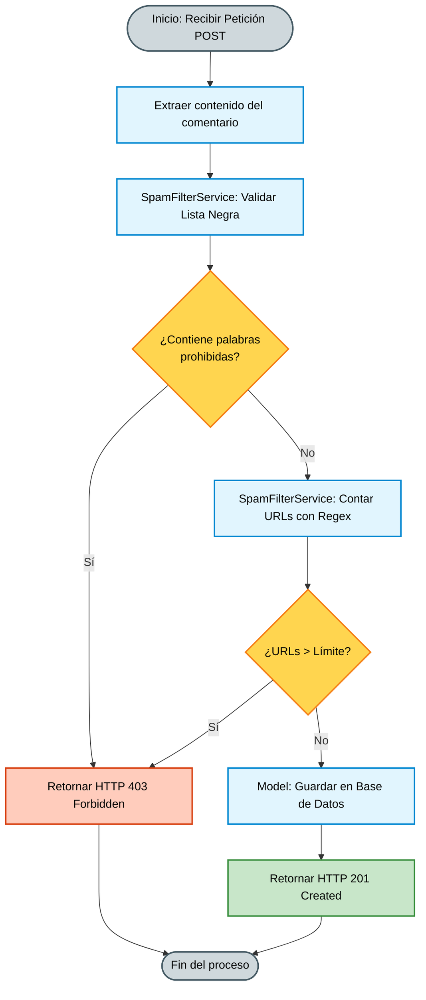

### 3.5. Vista de Despliegue (vista física)

**3.5.1. Diagrama de despliegue**
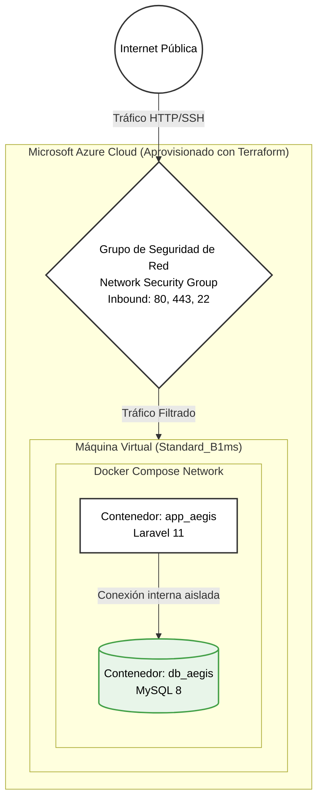

---

## 4. ATRIBUTOS DE CALIDAD DEL SOFTWARE

**Escenario de Funcionalidad**
El sistema demuestra su funcionalidad al interceptar exitosamente el 100% de las peticiones que cumplan con las reglas de negocio (ej. superar las 2 URLs) y bloqueándolas antes de alcanzar la base de datos.

**Escenario de Usabilidad**
Al ser un servicio de backend, la usabilidad se enfoca en el desarrollador y el administrador. Se garantiza mediante un código limpio, variables de entorno claras en el .env y un despliegue sin fricciones con comandos automatizados (Docker/Terraform).

**Escenario de confiabilidad**
El sistema previene inyecciones y ataques mediante la validación previa con expresiones regulares. La capa de datos en Azure está resguardada por un NSG (Network Security Group) que bloquea todo el tráfico no autorizado al puerto 3306.

**Escenario de rendimiento**
El motor de validación SpamFilterService es altamente eficiente, capaz de evaluar la heurística del texto y las listas negras devolviendo una respuesta en tiempos inferiores a 500 ms.

**Escenario de mantenibilidad**
La arquitectura separada en capas (Controlador -> Servicio -> Modelo) facilita la extensibilidad. Nuevas reglas anti-spam pueden añadirse al servicio sin necesidad de reescribir la lógica de la API ni la estructura de la base de datos.
